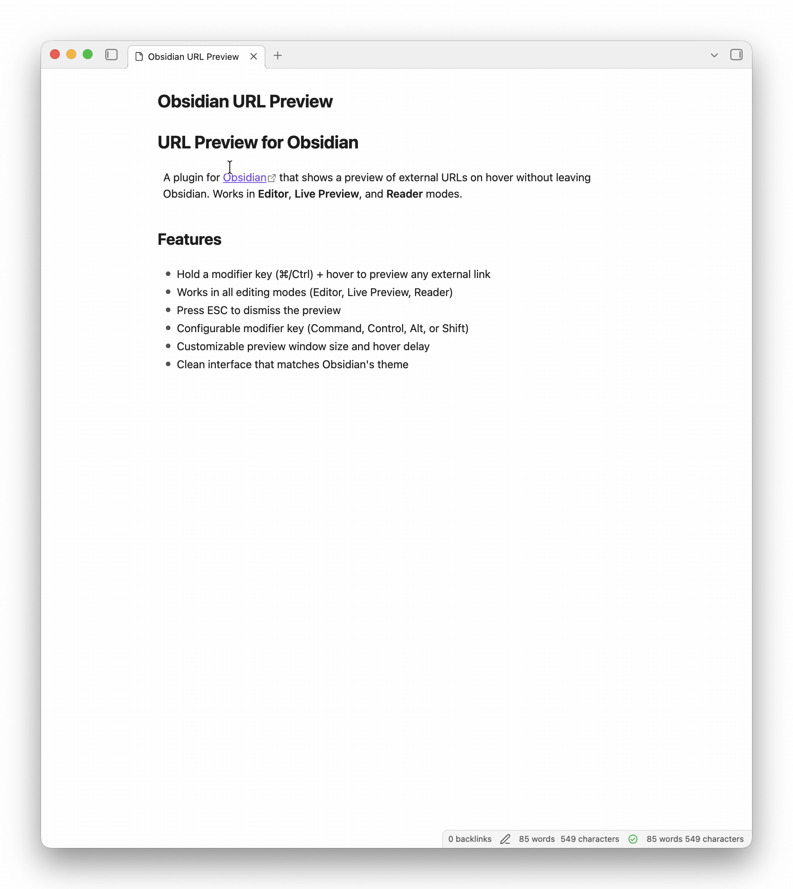

# URL Preview for Obsidian

A plugin for [Obsidian](https://obsidian.md) that shows a preview of external URLs on hover without leaving Obsidian. Works in **Editor**, **Live Preview**, and **Reader** modes.

## Features

- Hover any external link to see a website preview
- Works in all editing modes (Editor, Live Preview, Reader)
- Press ESC to dismiss the preview
- Customizable preview window size
- Configurable hover delay
- Clean interface that matches Obsidian's theme

## Installation

1. Open Obsidian Settings
2. Go to Community Plugins and disable Safe Mode
3. Click Browse and search for "URL Preview"
4. Install the plugin and enable it

## Settings

- **Hover Delay**: How long to wait before showing the preview (in milliseconds)
- **Maximum Height**: Maximum height of the preview window (in pixels)
- **Maximum Width**: Maximum width of the preview window (in pixels)

## Usage

Hover over any external link in your notes to see a preview of the webpage.

## Limitations

Some websites block iframe embedding and cannot be previewed. This is a browser security restriction that cannot be bypassed.

## Support

If you encounter issues or have suggestions, please file them on the [GitHub repository](https://github.com/ovitrif/obsidian-url-preview/issues).

## Changelog

See [CHANGELOG.md](CHANGELOG.md) for release history.

## License

MIT. See [LICENSE](LICENSE).
