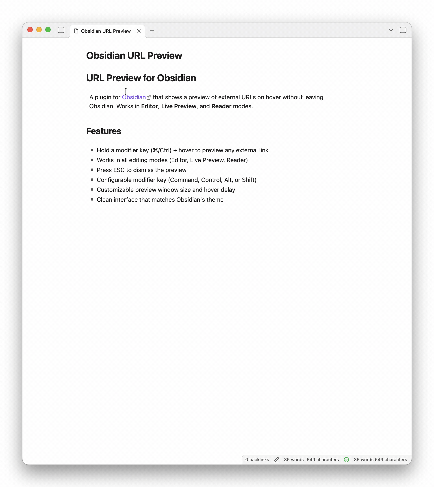

# URL Preview for Obsidian

A plugin for [Obsidian](https://obsidian.md) that shows a preview of external URLs on hover without leaving Obsidian. Works in **Editor**, **Live Preview**, and **Reader** modes.

## Features

- Hold a configurable modifier key (⌘, Control, Alt, or Shift) + hover to preview URLs
- Works in all view modes (Editor, Live Preview, Reader)
- Clean interface that matches Obsidian's theme
- Press ESC to dismiss the preview window
- Customize preview window size, hover delay until it appears, mouse sensitivity tolerance
- Resize preview window by dragging edges or corners
  - Accent-colored border highlight on resize handle hover (uses Obsidian's accent color)
  - Live size indicator showing dimensions during resize
  - Optionally persist resized dimensions across previews
- Loading spinner near cursor during hover delay
- Smart keyboard trigger suppression while editing (prevents unwanted popups)
- Pending preview auto-cancelled if modifier keys are released or mouse leaves link

## Installation

1. Open Obsidian Settings
2. Go to Community Plugins and disable Safe Mode
3. Click Browse and search for "URL Preview"
4. Install the plugin and enable it

## Settings

- **Require Modifier Key**: Only show preview when holding a modifier key (enabled by default)
- **Modifier Keys**: Choose which keys to hold (Command, Control, Alt, Shift — can combine multiple)
- **Close on Key Release**: Close preview when modifier key is released
- **Sticky Popup**: Keep preview open until ESC or click outside
- **Show Open in Browser Button**: Show a button to open the URL in the default browser
- **Show Close Button**: Show a button to close the preview popup
- **Hover Delay**: How long to wait before showing the preview (in milliseconds)
- **Mouse Stillness Delay**: Time the mouse must be stationary before showing preview
- **Maximum Height / Width**: Maximum dimensions of the preview window (in pixels)
- **Allow Resize**: Enable drag-to-resize on preview edges and corners
- **Persist Resize**: Remember resized dimensions for future previews (with reset button)

## Usage

Hold your modifier key (⌘ on Mac, Ctrl on Windows/Linux by default) and hover over any external link to see a preview.

## Limitations

Some websites block iframe embedding and cannot be previewed. This is a browser security restriction that cannot be bypassed.

## Support

If you encounter issues or have suggestions, please file them on the [GitHub repository](https://github.com/ovitrif/obsidian-url-preview/issues).

## Changelog

See [CHANGELOG.md](CHANGELOG.md) for release history.

## License

MIT. See [LICENSE](LICENSE).
